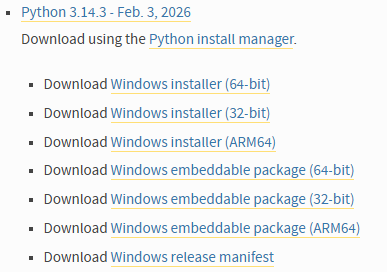

# Instalacja 

Jeden ze sposobów instalacji Pythona na Windowsie to pobranie instalatora z oficjalnej strony [https://www.python.org/downloads/windows/](https://www.python.org/downloads/windows/)



Wybieramy [Windows Installer (64-bit)](https://www.python.org/ftp/python/3.14.3/python-3.14.3-amd64.exe)

Ważne, żeby podczas instalacji zaznaczyć następujące opcje:

- *Add Python to PATH* (żeby mieć Pythona dostępnego w konsoli)

- Potem w *Customize installation* warto zaznaczyć:
   - pip
   - tcl/tk (GUI apps)
   - IDLE
   - py launcher
   - instalacja dla wszystkich użytkowników (jeśli ustawienia komputera na to pozwalają)

Kolejny krok to weryfikacja instalacji w konsoli (cmd/powershell):

```bash
python --version
pip --version
```

## Środowiska wirtualne

Środowisko wirtualne (ang. virtual environment, w skrócie venv) to jedna z rzeczy w Pythonie, która ułatwia zarządzanie projektami. To izolowane środowisko Pythona stworzone tylko dla jednego projektu. Zawiera swoją własną wersję interpretera Pythona i niezależny zestaw zainstalowanych pakietów. Korzystając ze środowiska wirtualnego każdy projekt może mieć inne wersje bibliotek.


Tworzenie wirtualnego środowiska o nazwie `venv` w katalogu projektu.

```bash
python -m venv venv
```

Aktywacja środowiska wirtualnego.

```bash
venv\Scripts\activate
```

W systemie Windows zdarza się, że jest zablokowane wywoływanie skryptów. Wtedy podczas tworzenia środowiska możemy dostać komunikat 

```
.\venv\Scripts\activate : File \venv\Scripts\Activate.ps1 cannot be loaded because running scripts is disabled on this system. For more information, see about_Execution_Policies at https:/go.microsoft.com/fwlink/?LinkID=135170.
```

W takiej sytuacji należy uruchomić poniższą komendę:


```bash
Set-ExecutionPolicy -Scope CurrentUser -ExecutionPolicy RemoteSigned
```

i spróbować ponownie uruchomić środowisko wirtualne.

**venv** to standardowe narzędzie do tworzenia środowisk wirtualnych dostępne w Pythonie od wersji 3.3. Umożliwia tworzenie izolowanych środowisk z własnymi bibliotekami, dzięki czemu różne projekty mogą używać różnych wersji pakietów bez konfliktów. Jest lekkie, proste w użyciu i nie wymaga instalacji dodatkowego oprogramowania.

**conda** to bardziej rozbudowany menedżer środowisk i pakietów, dostępny w dystrybucjach takich jak Anaconda czy Miniconda. W przeciwieństwie do venv pozwala instalować nie tylko pakiety Pythona, ale także zależności systemowe i biblioteki napisane w innych językach. 

**uv** to nowoczesne narzędzie do zarządzania środowiskami i pakietami w Pythonie, zaprojektowane z myślą o bardzo wysokiej wydajności. Jest napisane w języku Rust i może pełnić rolę zamiennika dla narzędzi takich jak venv i pip, oferując znacznie szybsze tworzenie środowisk oraz instalowanie zależności.

## Instalacja pakietów

Do instalacji pakietów wykorzystuje się aplikację `pip`. Po stworzeniu i aktywacji środowiska możemy sprawdzić jakie pakiety są zainstalowane:

```bash
pip list
```

A następnie zainstalować te, które wymagane są w naszym projekcie.

```bash
pip install pandas scikit-learn
```

Dobrą praktyką jest zapisywanie wykorzystywanych pakietów do pliku, dzięki czemu inna osoba może sprawdzić jakie wersje pakietów są wymagane do prawidłowego działania programu.

```bash
pip freeze > requirements.txt
```

W ten sposób łatwo też zainstalować wymagane pakiety przy migracji projektu.

```bash
pip install -r requirements.txt
```

## IDE

Do wygodnego korzystania z pythona przyda się odpowiednie zintegrowane środowisko programistyczne:

- [Visual Studio Code](https://code.visualstudio.com/) - obecnie najpopularniejsze

- [PyCharm](https://www.jetbrains.com/pycharm/) - świetny w wersji płatnej

- [Jupyter](https://jupyter.org/install) - notatnik pythonowy

- [Google Colab](https://colab.research.google.com/) - wersja online

- [RStudio](https://posit.co/download/rstudio-desktop/)

- [Positron](https://positron.posit.co/) - zmodyfikowany VSC pod analizę danych