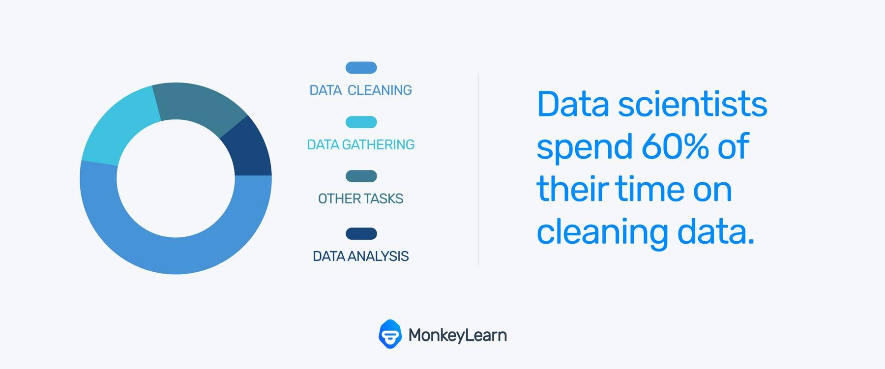

```{r include=FALSE}
library(tidyverse)
library(countdown)
```

# Zbiór danych

[German credit data](http://www.wawrowski.edu.pl/data/german_credit_data.csv)

1.  Age (numeric)
2.  Sex (text: male, female)
3.  Job (numeric: 0 - unskilled and non-resident, 1 - unskilled and resident, 2 - skilled, 3 - highly skilled)
4.  Housing (text: own, rent, or free)
5.  Saving accounts (text - little, moderate, quite rich, rich)
6.  Checking account (text, little, moderate, rich)
7.  Credit amount (numeric, in DM)
8.  Duration (numeric, in month)
9.  Purpose (text: car, furniture/equipment, radio/TV, domestic appliances.. and so on...)
10.  Risk (text: good/bad): it's our Target Variable, describes if client paid or didn't pay loan

---

## Zmienna objaśniana vs. zmienne objaśniające

.pull-left[

**Zmienna objaśniana**/zależna/decyzyjna (ang. dependent variable, target, ground truth, y) np. czy klient spłaci kredyt, jaka jest cena mieszkania.

- To wynik, który chcemy przewidzieć lub wyjaśnić.

- Zależy od innych zmiennych. 

]

.pull-right[

**Zmienne objaśniające**/niezależne/warunkowe (ang. independent variables, features, X) np. wiek, dochód, liczba dzieci.

- To czynniki, które wpływają na zmienną objaśnianą.

- Cechy wejściowe modelu.

]

--

$$y = f(X)$$

---

# Dane 

Dane surowe (raw data) bez odpowiedniego przygotowania nie będą się nadawać do zastosowania w uczeniu maszynowym. 




---

# Czyszczenie danych

- czyszczenie nazw kolumn

- usuwanie lub uzupełnianie braków danych

- usuwanie wartości odstających

- usuwanie duplikatów

- ujednolicanie lub grupowanie kategorii

---

# Przetwarzanie danych

- konwersja typów danych

- kodowanie danych kategorycznych (one-hot-encoding)

- normalizacja wartości numerycznych

- tworzenie nowych cech (feature engineering)

- podział zbioru

---

# Czyszczenie nazw kolumn

Natywny python

```python
df.columns = (
    df.columns
    .str.strip()  # usuń spacje
    .str.lower()  # małe litery
    .str.replace(' ', '_')  # spacje na podkreślniki
    .str.replace(r'[^\w]', '', regex=True)  # usuwanie znaków specjalnych
)

```

Pakiet [pyjanitor](https://github.com/pyjanitor-devs/pyjanitor/tree/dev)

```python 
from janitor import clean_names

df = df.clean_names()
```

---

# Braki danych

Możliwe rozwiązania

- usunięcie obserwacji z brakami danych

- imputacja statystyczna:

   - metody deterministyczne - zawsze te same wartości imputacyjne:
      
      - zastępowanie wartością przeciętną, imputacja regresyjna,
      - nie wprowadzają dodatkowego źródła błędu losowego,
      - zniekształcają rozkłady zmiennych
   
   - metody stochastyczne - można uzyskać różne wartości imputacyjne:
   
      - metoda hot-deck, stochastyczna imputacja regresyjna,
      - generują dodatkowy błąd,
      - lepiej zachowują rozkłady zmiennych

[Tomasz Piasecki - Imputacja dochodów w badaniach statystyki publicznej dotyczących gospodarstw domowych](https://stat.gov.pl/cps/rde/xbcr/lodz/ASSETS_Konferencja_MRS_2013_plakat_Piasecki_T_Imputacja_dochodow_w_badaniach_statystyki_publicznej.pdf)

---

class: inverse

`r countdown(minutes = 2, seconds = 0, top = 0)`

# `r fontawesome::fa("circle-question")` Pytanie do słuchaczy

Jaka statystyka najlepiej uzupełni braki w przypadku cechy numerycznej?

https://pollev.com/lukaszw470

---

# Zastępowanie wybraną wartością

Funkcja `fillna()` zastępuje braki danych wskazaną wartością.

```python
df['num_var'] = df['num_var'].fillna(df['num_var'].median()[0])
df['cat_var'] = df['cat_var'].fillna(df['cat_var'].mode()[0])
```

---

# `scikit-learn` - biblioteka do ML

Jeden z najważniejszych pakietów w Pythonie dla analizy i modelowania danych

- preprocessing danych (skalowanie, kodowanie, imputacja)

- podział na zbiór treningowy/testowy

- modele klasyfikacji, regresji, klasteryzacji

- walidacja krzyżowa i metryki oceny modelu

Dokumentacja: https://scikit-learn.org/

---

# Moduł `sklearn.impute`

- `SimpleImputer`: proste strategie: średnia, mediana, najczęstsza wartość

- `KNNImputer`: imputacja na podstawie najbliższych sąsiadów

- `IterativeImputer`: zaawansowana iteracyjna imputacja (np. z regresją)

- `MissingIndicator`: dodaje kolumny informujące o brakach

Wybrane algorytmy ML radzą się z obecnością braków danych.

Dokumentacja: https://scikit-learn.org/stable/modules/impute.html

---

# Fit i transform

Kluczowe metody w preprocessingu z wykorzystaniem pakietu `scikit-learn`

- `fit()` - analizuje dane wejściowe i zapamiętuje parametry przekształcenia

- `transform()` - wykorzystuje zapamiętane parametry z `fit()` i przekształca dane

- `fit_transform()` - wygodne połączenie `fit()` + `transform()` często stosowane na zbiorze treningowym

Nigdy nie używamy `fit()` na danych testowych, wyłącznie `transform()`.

```python
from sklearn.preprocessing import StandardScaler

scaler = StandardScaler()
X_train_scaled = scaler.fit_transform(X_train)
X_test_scaled = scaler.transform(X_test)  # tylko transform!
```

---

# `SimpleImputer`

Prosta imputacja medianą

```python
from sklearn.impute import SimpleImputer

imputer = SimpleImputer(strategy='median')
df[['num_var']] = imputer.fit_transform(df[['num_var']])

```

---

# `KNNImputer`

Uzupełnia brakujące dane na podstawie podobieństwa do innych rekordów. Dla każdej brakującej obserwacji: znajduje K najbliższych sąsiadów i wstawia średnią (ważoną) z tych wartości.

```python
from sklearn.impute import KNNImputer

knn_imputer = KNNImputer(n_neighbors=5)
df[['num_var']] = knn_imputer.fit_transform(df[['num_var']])
```

---

class: inverse

`r countdown(minutes = 5, seconds = 0, top = 0)`

# `r fontawesome::fa("circle-question")` Zadanie dla słuchaczy

Porównaj rozkład cechy `checking_account` z wykorzystaniem obu przedstawionych metod.

---

# Wartości odstające

Wykres pudełkowy i metoda  IQR (interquartile range)

```python
Q1 = df['num_var'].quantile(0.25)
Q3 = df['num_var'].quantile(0.75)
IQR = Q3 - Q1

# Granice
dolna = Q1 - 1.5 * IQR
górna = Q3 + 1.5 * IQR

# Usunięcie outlierów
df_clean = df[(df['num_var'] >= dolna) & (df['num_var'] <= górna)]

```

Usunięcie 1% lub 5% największych i najmniejszych wartości.

---

# Usuwanie duplikatów 

Funkcja `drop_dupliacates()` usuwa duplikaty ze zbioru danych.

W argumencie subset można podać kolumny, które mają być brane pod uwagę w analizie duplikatów. Domyślnie uwzględniane są wszystkie kolumny.

---

# Feature Engineering

Proces modyfikowania, przekształcania lub tworzenia nowych zmiennych (cech), które lepiej opisują dane i ułatwiają modelowi naukę.

Przykłady:

- Ekstrakcja informacji np. z dat: rok, miesiąc, dzień tygodnia

- Grupowanie wartości np. przedziały wiekowe (18–25, 26–40, itd.)

- Tworzenie nowych cech np. BMI = waga / wzrost$^2$

- Agregacje np. średni dochód na klienta

- Transformacje np. logarytmy, standaryzacja

---

class: inverse

`r countdown(minutes = 5, seconds = 0, top = 0)`

# `r fontawesome::fa("circle-question")` Pytanie do słuchaczy

Jakie nowe cechy można zaproponować dla zbioru credit?

https://pollev.com/lukaszw470

---

# Kodowanie zmiennych kategorycznych

One-Hot Encoding: zamiana wartości kategorycznych na kolumny binarne.

- tworzy nową kolumnę dla każdej unikalnej wartości w zmiennej kategorycznej

- wartość 1 oznacza obecność danej kategorii, 0 – jej brak

```python
df = pd.DataFrame({'płeć': ['kobieta', 'mężczyzna', 'kobieta']})
df_encoded = pd.get_dummies(df, columns=['płeć'])
```

```bash
   płeć_kobieta  płeć_mężczyzna
0             1               0
1             0               1
2             1               0
```

W module sklearn.preprocessing jest `OneHotEncoder`.

---

# Normalizacja cech

Modele oparte na odległościach (np. KNN, SVM) są wrażliwe na skalę cech. Zastosowanie normalizacji sprawia, że wszystkie cechy mają porównywalną skalę oraz przyspiesza i poprawia jakość uczenia modeli.

- StandardScaler: przekształca cechy do rozkładu o średniej = 0 i odchyleniu standardowym = 1

- MinMaxScaler: skaluje wartości do zakresu [0, 1]

```python
from sklearn.preprocessing import StandardScaler

scaler = StandardScaler()
X_scaled = scaler.fit_transform(X)
```

---

# Kodowanie etykiet

Interfejs modeli pakietu `scikit-learn` wymaga zakodowania zmiennej decyzyjnej jako wartości liczbowych. 

`LabelEncoder` przekształca napisy/kategorie w liczby całkowite i każdej unikalnej wartości przypisuje unikalny numer.

```python
from sklearn.preprocessing import LabelEncoder

le = LabelEncoder()
y = ['dobry', 'zły', 'dobry', 'dobry', 'zły']
y_encoded = le.fit_transform(y)
```

---

# Podział danych

- dane uczące (treningowe) - zbiór przykładów używanych do dopasowania parametrów algorytmu

- dane testowe - niezależny od danych uczących zbiór przykładów o takim samym rozkładzie jak dane uczące

- dane walidacyjne - zbiór przykładów używanych do dopasowania hiperparametrów 

Często nazewnictwo danych testowych i walidacyjnych jest mylone.

[Wikipedia](https://en.wikipedia.org/wiki/Training%2C_validation%2C_and_test_sets)

---

# Podział zbioru na treningowy i testowy

```python
from sklearn.model_selection import train_test_split

X_train, X_test, y_train, y_test = train_test_split(
    X, y, test_size=0.2, random_state=42, stratify=y
)
```

---

class: inverse, center, middle

# Pytania?