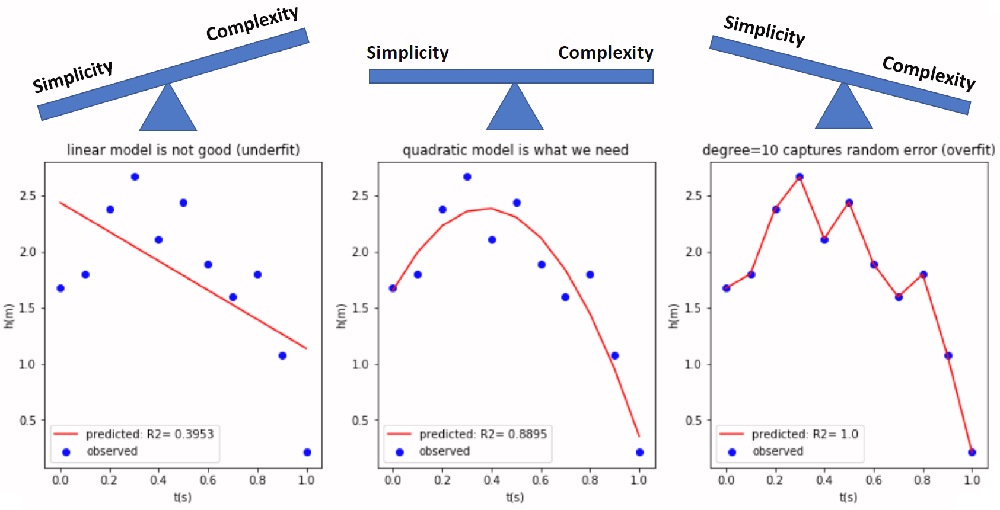
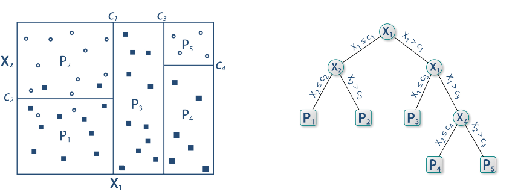
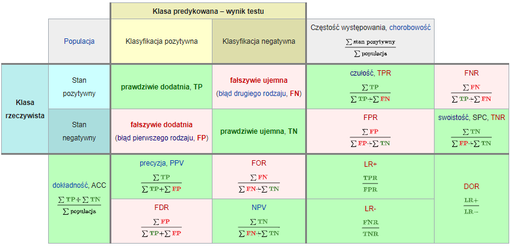
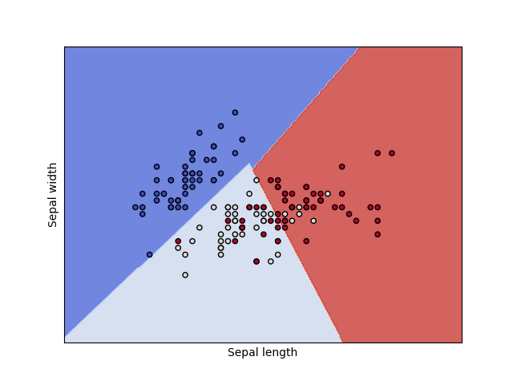

```{r include=FALSE}
library(tidyverse)
library(countdown)

knitr::opts_chunk$set(message = FALSE, warning = FALSE, fig.width = 12, fig.height = 6)
```

# Podział metod

Uczenie nadzorowane - końcowy wynik jest znany

- klasyfikacja

- regresja

Uczenie nienadzorowane - końcowy wynik nie jest znany

- grupowanie obiektów

- grupowanie cech

---

# Podział metod


---

# Klasyfikacja 

- dane tabelaryczne

- obrazy

- teksty

---

# Klasyfikacja

- binarna (binary) - tylko dwa warianty: zachorowanie, spłata kredytu

- wieloklasowa (multiclass) - typ klienta

- wieloetykietowa (multilabel) - gatunek filmu

[A visual introduction to machine learning](http://www.r2d3.us/visual-intro-to-machine-learning-part-1/)

[Model Tuning and the Bias-Variance Tradeoff](http://www.r2d3.us/visual-intro-to-machine-learning-part-2/)

---

# Algorytmy

- white-box: regresja logistyczna, drzewa decyzyjne

- black-box: sieci neuronowe, XGBoost

Niektóre z metod opierają się na losowości i wyniki mogą się wtedy nieznacznie różnić pomiędzy uruchomieniami. Aby tego uniknąć można zastosować ziarno generatora.

---

# Złożoność modelu


---

# Złożoność modelu



---

# Drzewa decyzyjne


[Źródło](https://github.com/WhyR2019/presentations/blob/master/Keynotes/Marvin_Wright_RF.pdf)

---

# Drzewa decyzyjne


---

# Drzewa decyzyjne


---

# Drzewa decyzyjne


---

# Drzewa decyzyjne



---

# Drzewa decyzyjne


---

# Drzewa decyzyjne


---

# Macierz pomyłek (confusion matrix)



[Źródło](https://pl.wikipedia.org/wiki/Tablica_pomy%C5%82ek)

---

# Miary

Wyniki klasyfikacji można oceniać za pomocą wielu miar:

- Dokładność (accuracy): % poprawnie zaklasyfikowanych

- Precyzja (precison): % poprawnie rozpoznanych przypadków pozytywnych TP/(TP+FP)

- Czułość (sensitivity/recall): % prawdziwie pozytywnych TP/(TP+FN)

- Swoistość (specificity): % prawdziwie negatywnych TN/(TN+FP)

- F1: średnia harmoniczna z czułości i precyzji 2TP/(2TP+FP+FN)

---

# Krzywa ROC

Krzywa ROC to jeden ze sposobów wizualizacji jakości klasyfikacji, pokazujący zależności wskaźników TPR (True Positive Rate) oraz FPR (False Positive Rate).

1. obliczamy prawdopodobieństwo klasyfikacji do danej klasy

2. testujemy wiele progów prawdopodobieństwa (domyślnie 0,5)

3. dla każdego progu obliczamy macierz pomyłek

Pole pod krzywą ROC - AUC (Area under curve) jest jedną z miar jakości klasyfikacji. AUC = 1 (klasyfikator idealny), AUC = 0.5 (klasyfikator losowy), AUC < 0.5 (klasyfikator gorszy od losowego).

[Źródło](https://algolytics.pl/tutorial-jak-ocenic-jakosc-i-poprawnosc-modeli-klasyfikacyjnych-czesc-4-krzywa-roc/)

---

# SVM - maszyna wektorów nośnych



---

# SVM - maszyna wektorów nośnych


---

# Lasy losowe

1.  Weź zbiór danych
2.  Wybierz $n$ drzew do zbudowania 
3.  Dla wartości od $i = 1$ do $n$:
4.  |  Wylosuj próbę bootstrapową
5.  |  Stwórz drzewo na podstawie wylosowanych danych
6.  |  Dla każdego podziału
7.  |  | Wylosuj $m$ zmiennych ze wszystkich $p$ zmiennych
8.  |  | Wybierz najlepszą zmienną do podziału
9.  |  | Stwórz podział
10. | Zakończ proces budowy drzewa kiedy kryterium jest optymalne
11. Zwróć zbiór wynikowych drzew

[Źródło](https://bradleyboehmke.github.io/HOML/random-forest.html)

---

# Boosting gradientowy


---

# Walidacja krzyżowa

Technika oceny modelu, aby sprawdzić jego stabilność i generalizację na różnych podzbiorach danych.


[Źródło](https://ubc-dsci.github.io/introduction-to-datascience/)

---

# Tuning hiperparametrów

Domyślne parametry modelu nie muszą dawać najlepszych rezultatów. W celu ulepszenia klasyfikatora stosuje się metody przeszukiwania parametrów. 

- learning rate

- max depth

- number of trees

- sample rate

Można przeszukiwać całą przestrzeń parametrów (intensywne obliczeniowo) albo losowo.

---

class: inverse

# Zadanie

`r countdown(minutes = 10, seconds = 0, top = 0)`

Przeprowadź tuning parametrów dla modelu lasu losowego.

---

# Objaśnianie modelu

[Explanatory Model Analysis](https://pbiecek.github.io/ema/)

[Interpretable Machine Learning](https://christophm.github.io/interpretable-ml-book/)

- Ważność cech - jak bardzo model wykorzystuje daną cechę do predykcji.

- Partial dependency plots - jak zmienia się prawdopodobieństwo klasyfikacji w zależności od predyktora.

- SHAP - oblicza udział każdej cechy w predykcji. 

---

class: inverse

# Zadanie

Przeprowadź [klasyfikację mieszkań](http://www.wawrowski.edu.pl/data/sf_ny_homes.csv) 

---

class: inverse, center, middle

# Pytania?