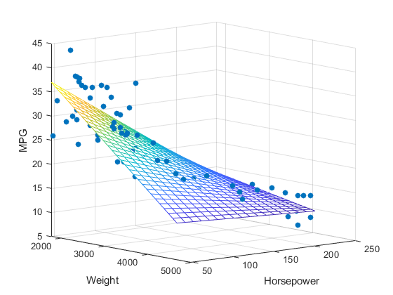

```{r include=FALSE}
library(tidyverse)
library(countdown)

salary <- read_csv("data/salary.csv")

knitr::opts_chunk$set(message = FALSE, warning = FALSE, fig.width = 12, fig.height = 6)
```

# Regresja

Funkcyjne odwzorowanie zależności pomiędzy badanymi zmiennymi. 

Cele analizy regresji:

- poznawcze - badanie związków przyczynowo-skutkowych

- predykcyjne - oszacowanie nieznanej wartości cechy

Model regresji jest tylko przybliżeniem rzeczywistości!

---

# Regresja prosta

Analiza dwóch cech:

- zmienna objaśniana (zależna) oznaczana jako $y$

- zmienna objaśniająca (niezależna) oznaczana jako $x$

Przykłady: 

- zależność wielkości sprzedaży od wydatków na reklamę

- zależność wynagrodzenia od lat doświadczenia

---

# Przykład

Zbiór [salary](http://www.wawrowski.edu.pl/data/salary.xlsx) zawiera informacje o rocznym wynagrodzeniu (w $) oraz liczbie lat doświadczenia. 
---

# Wykres rozrzutu

```{r echo=FALSE}

ggplot(salary, aes(x = YearsExperience, y = Salary)) + 
  geom_point() + 
  theme_light()

```

---

# Wykres rozrzutu

```{r echo=FALSE}

ggplot(salary, aes(x = YearsExperience, y = Salary)) + 
  geom_smooth(method = "lm", se=FALSE) +
  geom_point() +
  theme_light()

```


---

# Regresja prosta

Weźmy pod uwagę prosty przykład dochodów i wydatków:

```{r echo=FALSE}
d <- data.frame(wydatki=c(2300,1800,2400,2300,2800,2000,2100),
                dochody=c(2600,2400,2900,2800,3000,2500,2700))

d %>% knitr::kable()
```

---

# Regresja prosta

Wykres rozrzutu

```{r echo=FALSE}
ggplot(d, aes(x = dochody, y = wydatki)) + 
  geom_point(size = 2) +
  xlab("dochody (X)") + 
  ylab("wydatki (Y)") +
  xlim(2400,3000) +
  ylim(1600,3100) +
  theme_light()
```

---

# Regresja prosta

Spróbujmy teraz dopasować kilka prostych - mogą one przebiegać na wiele różnych sposobów.

```{r echo=FALSE}
ggplot(d, aes(x = dochody, y = wydatki)) + 
  geom_point(size = 2) +
  geom_hline(yintercept = 2243, color = "blue", alpha = 0.8, size = 1.1) +
  geom_abline(slope = 1.9, intercept = -2780, color = "green", alpha = 0.8, size = 1.1) +
  geom_abline(slope = 1.357, intercept = -1421.429, color = "red", alpha = 0.8, size = 1.1) +
  xlab("dochody (X)") + 
  ylab("wydatki (Y)") +
  xlim(2400,3000) +
  ylim(1600,3100) +
  theme_light()
```

---

# Regresja prosta

W następnym kroku obliczamy różnice pomiędzy istniejącymi punktami, a odpowiadającym im wartościom na prostej: 

```{r echo=FALSE}
d <- d %>% 
  mutate(niebieska_y=dochody-2243,
         zielona_y=1.9*dochody-2780,
         czerwona_y=1.357*dochody-1421.429) %>% 
  mutate(niebieska=(wydatki-niebieska_y)^2,
         zielona=(wydatki-zielona_y)^2,
         czerwona=(wydatki-czerwona_y)^2)

line1 <- data.frame(x = c(d$dochody[1], d$dochody[1]), y=c(d$wydatki[1], d$czerwona_y[1]))
line2 <- data.frame(x = c(d$dochody[2], d$dochody[2]), y=c(d$wydatki[2], d$czerwona_y[2]))
line3 <- data.frame(x = c(d$dochody[3], d$dochody[3]), y=c(d$wydatki[3], d$czerwona_y[3]))
line4 <- data.frame(x = c(d$dochody[4], d$dochody[4]), y=c(d$wydatki[4], d$czerwona_y[4]))
line5 <- data.frame(x = c(d$dochody[5], d$dochody[5]), y=c(d$wydatki[5], d$czerwona_y[5]))
line6 <- data.frame(x = c(d$dochody[6], d$dochody[6]), y=c(d$wydatki[6], d$czerwona_y[6]))
line7 <- data.frame(x = c(d$dochody[7], d$dochody[7]), y=c(d$wydatki[7], d$czerwona_y[7]))

ggplot(d, aes(x = dochody, y = wydatki)) + 
  geom_point(size = 2) +
  geom_hline(yintercept = 2243, color = "blue", alpha = 0.8, size = 1.1) +
  geom_abline(slope = 1.9, intercept = -2780, color = "green", alpha = 0.8, size = 1.1) +
  geom_abline(slope = 1.357, intercept = -1421.429, color = "red", alpha = 0.8, size = 1.1) +
  geom_line(data = line1, aes(x=x, y=y), color = "grey60", size = 1.2) +
  geom_line(data = line2, aes(x=x, y=y), color = "grey60", size = 1.2) +
  geom_line(data = line3, aes(x=x, y=y), color = "grey60", size = 1.2) +
  geom_line(data = line4, aes(x=x, y=y), color = "grey60", size = 1.2) +
  geom_line(data = line5, aes(x=x, y=y), color = "grey60", size = 1.2) +
  geom_line(data = line6, aes(x=x, y=y), color = "grey60", size = 1.2) +
  geom_line(data = line7, aes(x=x, y=y), color = "grey60", size = 1.2) +
  xlab("dochody (X)") + 
  ylab("wydatki (Y)") +
  xlim(2400,3000) +
  ylim(1600,3100) +
  theme_light()
```

---

# Regresja prosta

Oznaczając $y_i$ jako rzeczywista wartość wydatków i $\hat{y_i}$ jako wartość leżącą na prostej zależy nam na minimalizowaniu wyrażenia $\sum\limits_{i=1}^{n}{(y_{i}-\hat{y}_{i})^2} \rightarrow min$. Różnica $y_{i}-\hat{y}_{i}$ jest nazywana resztą (ang. residual). Wyznaczając te wartości dla analizowanych przez nas prostych otrzymamy następujące wyniki:

```{r echo=FALSE}
d %>% 
  select(6:8) %>% 
  pivot_longer(1:3) %>% 
  group_by(name) %>% 
  summarise(suma_kwadratow_reszt=round(sum(value))) %>% 
  arrange(suma_kwadratow_reszt) %>% 
  knitr::kable()
```

---

# Regresja prosta

Ogólna postać regresji prostej jest następująca:

$$\hat{y}_{i}=b_{1}x_{i}+b_{0}$$

gdzie $\hat{y}$ oznacza wartość teoretyczną, leżącą na wyznaczonej prostej. 

Wobec tego wartości empiryczne (y) będą opisane formułą:

$$y_{i}=b_{1}x_{i}+b_{0}+u_{i}$$

w której $u_i$ oznacza składnik resztowy wyliczany jako $u_{i}=y_{i}-\hat{y}_{i}$. 

---

# Regresja prosta w Python

Sklearn

```python
from sklearn.linear_model import LinearRegression

model = LinearRegression()
model.fit(X, y)
```

Statsmodels

```python
import statsmodels.api as sm

X_const = sm.add_constant(X)
model_sm = sm.OLS(y, X_const).fit()

print(model_sm.summary())
```

---

# Współczynniki $b$

**Współczynnik kierunkowy** $b_1$ informuje o ile przeciętne zmieni się wartość zmiennej objaśnianej $y$, gdy wartość zmiennej objaśniającej $x$ wzrośnie o jednostkę.

**Wyraz wolny** $b_0$ to wartość zmiennej objaśnianej $y$, w sytuacji w której wartość zmiennej objaśniającej $x$ będzie równa 0. Często interpretacja tego parametru nie ma sensu.

---

# Dopasowanie modelu 

**Współczynnik determinacji** określa, jaki procent wariancji zmiennej objaśnianej został wyjaśniony przez funkcję regresji. $R^2$ przyjmuje wartości z przedziału $<0;1>$ ( $<0\%;100\%>$ ), przy czym model regresji tym lepiej opisuje zachowanie się badanej zmiennej objaśnianej, im $R^2$ jest bliższy jedności (bliższy 100%)

$$R^2=1-\frac{\sum\limits_{i=1}^{n}{(y_{i}-\hat{y}_{i})^2}}{\sum\limits_{i=1}^{n}{(y_{i}-\bar{y}_{i})^2}}$$

Współczynnik determinacji przyjmuje wartości z przedziału $<0;1>$ wyłącznie wtedy, kiedy został wykorzystany model oszacowany metodą najmniejszych kwadratów. W przeciwnym przypadku wartości tego współczynnika mogą być z przedziału $(-\infty;1>$.

---

# Dopasowanie modelu 

**Dopasowany współczynnik determinacji** ma na celu uwzględnienie i eliminację własności współczynnika determinacji polegającej na automatycznym zwiększaniu wartości $R^2$ przy dodawaniu kolejnych cech do modelu. W tej formule uwzględnia się liczbę obserwacji oraz liczbę cech objaśniających:

$$\bar{R}^2=1-(1-R^2)\frac{n-1}{n-p-1}$$
Dopasowany współczynnik determinacji $\bar{R}^2$ będzie zawsze mniejszy bądź równy wartości $R^2$. Może także przyjmować wartości ujemne.

---

# Test Walda

- sprawdzenie istotności parametrów $b$

- sprawdzenie istotności całego wektora parametrów $b$

---

# Inne miary jakości

Do analizy jakości modelu można także wykorzystać inne miary obliczane na podstawie wartości rzeczywistych oraz predykcji. 

- MAE - Mean Absolute Error

- MAPE - Mean Absolute Percentage Error

- MSE - Mean Squared Error

- RMSE - Root Mean Squared Error

---

# Trend liniowy

W przypadku istnienia zależności liniowej w czasie, przedstawioną metodę można także wykorzystać do prognozowania wartości cechy w przyszłości. 

```{r}
df_trend  <- data.frame(rok=c(2016, 2017, 2018, 2019, 2020),
                        t=1:5,
                        y=c(53, 55, 57, 56, 59))

knitr::kable(df_trend)
```

---

# Sezonowość

Dla danych charakteryzujących się występowaniem sezonowości należy skorzystać z metod, które to uwzględnią np.

- [prophet](https://facebook.github.io/prophet/)

- [ARIMA](https://www.statsmodels.org/stable/generated/statsmodels.tsa.arima.model.ARIMA.html)

- [TimeGPT](https://docs.nixtla.io/docs/getting-started-timegpt_quickstart)

---

class: inverse

# Zadanie 

Stwórz model regresji prostej objaśniający zależność sprzedaży od liczby klientów na podstawie [sklepu Rossmann](http://www.wawrowski.edu.pl/data/sklep77.csv). Jaka jest prognozowana sprzedaż dla 300, 700 i 1050 klientów?

`r countdown(minutes = 10, seconds = 0, top = 0)`

---

# Regresja wieloraka

Ogólna postać regresji wielorakiej jest następująca:

$$\hat{y}_{i}=b_{1}x_{1i}+b_{2}x_{2i}+...+b_{k}x_{ki}+b_{0}$$

W tym przypadku nie wyznaczamy prostej tylko $k$-wymiarową przestrzeń.

---

# Regresja trzech zmiennych



---

# Przykład

Na podstawie zbioru [real estate](http://www.wawrowski.edu.pl/data/real_estate.csv) zbuduj model objaśniający wysokość ceny.

Opis zbioru: https://archive.ics.uci.edu/dataset/477/real+estate+valuation+data+set

---

# Badanie współliniowości

Współczynnik korelacji informuje o sile zależności pomiędzy dwoma cechami ilościowymi. Jest wielkością unormowaną, przyjmuje wartości z przedziału $r\in<-1;1>$.

Jeśli:

- $r_{xy}=1$ - korelacja dodatnia doskonała,
- $0<r_{xy}<1$ - korelacja dodatnia niedoskonała (słaba/umiarkowana/silna)
- $r_{xy}=0$ - brak zależności,
- $-1<r_{xy}<0$ - korelacja ujemna niedoskonała (słaba/umiarkowana/silna)
- $r_{xy}=-1$ - korelacja ujemna doskonała.

---

# Wartości odstające

**Miara Cooka** jest obliczana poprzez usunięcie i-tej obserwacji z danych i ponowne obliczenie parametrów regresji. Podsumowuje, jak bardzo wszystkie wartości w modelu regresji zmieniają się po usunięciu i-tej obserwacji. Każda obserwacja, dla której wartość miary Cooka przekracza próg obliczany jako $4/n$ jest traktowana jaka wartość odstająca.

**Reszty studentyzowane** oblicza się, dzieląc resztę przez szacunkowe odchylenie standardowe. Odchylenie standardowe dla każdej reszty jest obliczane z wyłączeniem danej obserwacji. Obserwacje dla których wartość reszty przekracza 3 uznaje się za odstające.

---

class: inverse

# Zadanie

Na podstawie zbioru dotyczącego [ubezpieczenia zdrowotnego](http://www.wawrowski.edu.pl/data/insurance.csv) określ jakie czynniki wpływają na jego wysokość. 

https://www.kaggle.com/datasets/mirichoi0218/insurance

`r countdown(minutes = 10, seconds = 0, top = 0)`

---

class: inverse, center, middle

# Pytania?