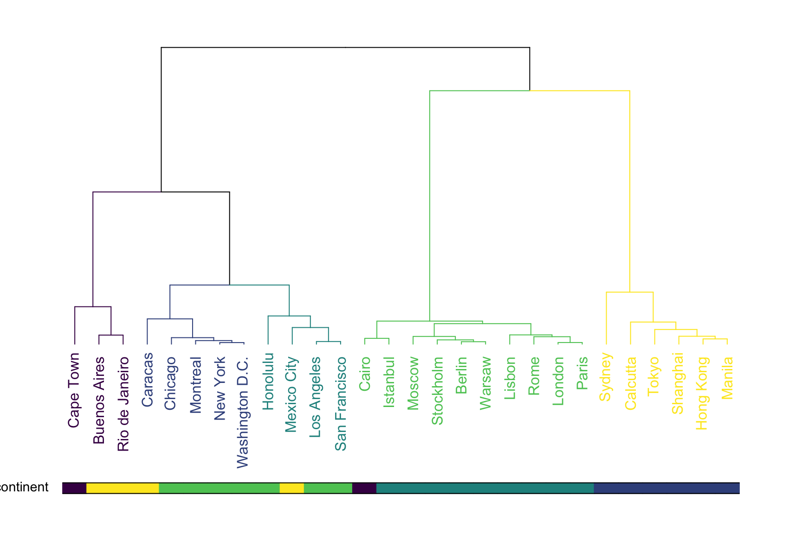

```{r include=FALSE}
library(tidyverse)
library(countdown)

knitr::opts_chunk$set(message = FALSE, warning = FALSE, fig.width = 12, fig.height = 6)
```

# Podział metod

Uczenie nadzorowane - końcowy wynik jest znany

- klasyfikacja

- regresja

Uczenie nienadzorowane - końcowy wynik nie jest znany

- grupowanie obiektów

- grupowanie cech

---

# Podział metod


---

# Grupowanie

Metoda iteracyjna - k-średnich:

```python
from sklearn.cluster import KMeans
kmeans = KMeans(n_clusters=5, init="k-means++")
clusters_kmeans = kmeans.fit_predict(z)
```

Metoda hierarchiczna:

```python
from sklearn.cluster import AgglomerativeClustering
hier = AgglomerativeClustering(n_clusters=5, linkage="ward")
clusters_hier = hier.fit_predict(z)
```


---

# Wybór liczby grup

**Metoda łokcia (wykres osypiska)**

Szukamy tzw. „łokcia” na wykresie inercji, czyli miejsca, gdzie dalsze zwiększanie liczby klastrów nie powoduje już dużego spadku błędu.

**Indeks Calińskiego-Harabasza**

Im większa wartość tego indeksu, tym lepsze (bardziej zwarte i rozdzielne) klastry. Najwyższy pik sugeruje najlepszą liczbę klastrów.

---

# Idea

Liczenie odległości pomiędzy analizowanymi obiektami.

Cechy opisujące obiekty mogą być wyrażone w różnych jednostkach np. w segmentacji klientów:

- wiek w latach

- wydatki na zakupy

- liczba wizyt w sklepie

W związku z tym konieczna jest **normalizacja** cech czyli pozbawienie ich mian.

Najpopularniejszą metodą normalizacji jest standaryzacja:

$z=\frac{x-\bar{x}}{s}$

gdzie: $\bar{x}$ - średnia, $s$ - odchylenie standardowe.

---

# Standaryzacja

```{r echo=FALSE}
library(tidyverse)
library(patchwork)

sklep77 <- read_csv("data/sklep77.csv") %>% 
  filter(czy_otwarty == "Tak")

p1 <- ggplot(sklep77, aes(x=liczba_klientow, y=sprzedaz)) +
  geom_point() +
  xlab("Liczba klientów (w osobach)") +
  ylab("Sprzedaż (w EUR)") +
  ggtitle("Wartości oryginalne") +
  theme_light()

p2 <- sklep77 %>% 
  mutate_at(vars(4:5), scale) %>% 
  ggplot(aes(x=liczba_klientow, y=sprzedaz)) +
  geom_point() +
  xlab("Liczba klientów") +
  ylab("Sprzedaż") +
  ggtitle("Wartości standaryzowane") +
  theme_light()

p1 + p2
```


---

# Metoda k-średnich

1. Wskaż liczbę grup $k$.

2. Wybierz dowolne $k$ punktów jako centra grup.

3. Przypisz każdą z obserwacji do najbliższego centroidu.

4. Oblicz nowe centrum grupy.

5. Przypisz każdą z obserwacji do nowych centroidów. Jeśli któraś obserwacja zmieniła grupę - przejdź do kroków nr 3 i 4, a w przeciwnym przypadku zakończ algorytm.

---

# Metoda k-średnich


[źródło](https://dashee87.github.io/data%20science/general/Clustering-with-Scikit-with-GIFs/)

---

# Przykład

Segmentacja [klientów sklepu](http://www.wawrowski.edu.pl/data/klienci.csv) w oparciu o następujące dane:

- klientID - identyfikator klienta

- plec - płeć

- wiek - wiek

- roczny_dochod - roczny dochód wyrażony w tys. dolarów

- wskaznik_wydatkow - klasyfikacja sklepu od 1 do 100

---

class: inverse

# Zadanie

Dokonaj grupowania danych dotyczących [32 samochodów](http://www.wawrowski.edu.pl/data/auta.csv) według następujących zmiennych: pojemność, przebieg, lata oraz cena.

`r countdown(minutes = 10, seconds = 0, top = 0)`

---

# Metoda hierarchiczna

1. Każda obserwacji stanowi jedną z $N$ pojedynczych grup.

2. Na podstawie macierzy odległości połącz dwie najbliżej leżące obserwacje w jedną grupę.

3. Połącz dwa najbliżej siebie leżące grupy w jedną.

4. Powtórz kroki nr 2 i 3, aż do uzyskania jednej grupy.

---

# Metody tworzenia wiązań

| Metoda   | Miara odległości  | Zalety                              | Wady                               |
| -------- | ----------------- | ----------------------------------- | ---------------------------------- |
| Single   | Najbliższe punkty | Działa dla nieregularnych kształtów | Efekt łańcucha, wrażliwość na szum |
| Complete | Najdalsze punkty  | Zwarte klastry                      | Może zniekształcać duże klastry    |
| Average  | Średnia odległość | Dobry kompromis                     | Koszt obliczeniowy                 |
| Ward     | Wzrost wariancji  | Zwarte, równoliczne klastry         | Źle radzi sobie z nieregularnymi   |

---

# Dendrogram



[źródło](https://www.data-to-viz.com/graph/dendrogram.html)

---

class: inverse

# Zadanie

Do danych z poprzedniego zadania zastosuj metodę hierarchiczną.

`r countdown(minutes = 10, seconds = 0, top = 0)`

---

# Inne algorytmy grupowania

Algorytmów grupowania jest bardzo wiele. 

- [DBSCAN](https://pl.wikipedia.org/wiki/DBSCAN)

- [K-modes](https://www.geeksforgeeks.org/machine-learning/k-mode-clustering-in-python/) - dla danych kategorycznych

- [Grupowanie rozmyte](https://www.geeksforgeeks.org/machine-learning/ml-fuzzy-clustering/) - obiekt może przynależeć do kilku grup

Niektóre z nich mają na celu wykrywanie anomalii, dzieląc dane zawsze na dwie grupy - obserwacji nietypowych oraz typowych.

- [Local Outlier Factor](https://en.wikipedia.org/wiki/Local_outlier_factor)

- [One Class SVM](https://scikit-learn.org/stable/modules/generated/sklearn.svm.OneClassSVM.html)

---

# Skuteczność algorytmów


Źródło: https://scikit-learn.org/stable/auto_examples/cluster/plot_cluster_comparison.html
---

# Redukcja wymiarów

- [PCA](https://miroslawmamczur.pl/na-czym-polega-analiza-skladowych-glownych-pca/)

- [t-SNE](https://miroslawmamczur.pl/jak-dziala-metoda-redukcji-wymiarow-t-sne/)

- [UMAP](https://umap-learn.readthedocs.io/en/latest/basic_usage.html)

---

# Paradoks Simpsona

Efekt działania kilku grup wydaje się odwrócony, kiedy grupy są połączone.


--

- Nabór na Uniwersytecie w Berekley w 1951 roku: spośród kandydatów przyjęto 45% mężczyzn i 30% kobiet.

- Uniwersytet został oskarżony o seksizm i sprawa została skierowana do sądu.

---

# Zbiór palmerpenguins

[Zbiór danych na temat pingwinów](https://github.com/allisonhorst/palmerpenguins)


---

class: inverse, center, middle

# Pytania?