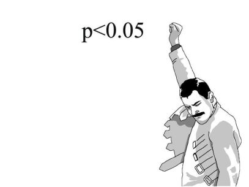

```{r include=FALSE}
library(tidyverse)
library(countdown)
```

class: inverse

# Zadanie

`r countdown(minutes = 10, seconds = 0, top = 0)`

Na podstawie pliku [smog](http://wawrowski.edu.pl/data/smog_pszczyna.csv):

- wczytaj zbiór danych.

- stwórz nową zmienną `pm10_poziom`, która będzie przyjmowała wartość "w normie" dla `pm10` < 50 i "podwyższony" dla wartości `pm10` >= 50.

- stwórz nową zmienną `tmin_zero`, która będzie przyjmowała wartości "poniżej zera" dla `tmin_daily` < 0 i "powyżej zera" dla `tmin_daily` > 0.

- przygotuj wykres punktowy przedstawiający minimalną i maksymalną temperaturę.

- utwórz nowy zbiór danych o nazwie `smog2017`, który będzie zawierał informacje tylko z roku 2017.

---

# Testowanie hipotez

1. Sformułowanie dwóch wykluczających się hipotez - zerowej $H_0$ oraz alternatywnej $H_1$

2. Wybór odpowiedniego testu statystycznego

3. Określenie dopuszczalnego prawdopodobieństwo popełnienia błędu I rodzaju (czyli poziomu istotności $\alpha$) 

4. Podjęcie decyzji

---

# Wartość p

.pull-left[

- najostrzejszy poziom istotności, przy którym możemy odrzucić hipotezę $H_0$

- podjęcie decyzji na podstawie porównania wartości p z poziomem istotności $\alpha$

- $p < \alpha$ - odrzucamy hipotezę zerową

- [Rozważania o p-value](http://cejsh.icm.edu.pl/cejsh/element/bwmeta1.element.cejsh-e3daa053-7cf2-4eee-9192-16c48c3a7a45/c/05.pdf)

- [Oświadczenie Amerykańskiego Towarzystwa statystycznego o stosowaniu wartości p](https://idane.pl/post/oswiadczenie-amerykanskiego-towarzystwa-statystycznego-o-stosowaniu-wartosci-p-i-co-z-tego-wynika/)

]

.pull-right[



]

---

# Testy statystyczne


---

# Testy statystyczne

|                       | Skala nominalna - nieparametryczne | Skala porządkowa - nieparametryczne                  | Skala ilorazowa - parametryczne             |
|-----------------------|------------------------------------|------------------------------------------------------|---------------------------------------------|
| Jedna próba           | Test zgodności $\chi^2$    | Test zgodności Shapiro-Wilka, Test Wilcoxona | Test t                   |
| Dwie próby niezależne | Test niezależności $\chi^2$, Test zgodności $\chi^2$ | Test Flignera-Killeena, Test Manna-Whitneya | Test F, Test t                |
| Dwie próby zależne    | Test McNemara     | Test Wilcoxona  | Test t    |
| K prób niezależnych   | Test zgodności $\chi^2$ | Test Flignera-Killeena, Test Kruskala-Wallisa | Test Bartletta, ANOVA |

---

<center></center>

[źródło](https://philipppro.github.io/Statistical_tests_overview/)

---

# Test niezależności $\chi^2$

Za pomocą testu niezależności $\chi^2$ można sprawdzić czy pomiędzy dwiema cechami jakościowymi występuje zależność.

- $H_0:$ zmienne są niezależne,

- $H_1:$ zmienne nie są niezależne.

---

# Test proporcji

Test proporcji pozwala odpowiedzieć na pytanie czy odsetki w jednej, dwóch lub więcej grupach różnią się od siebie istotnie.

- $H_0: p_1=p_2$

- $H_1: p_1 \neq p_2$ lub $H_1: p_1 > p_2$ lub $H_1: p_1 < p_2$

---

# Test normalności

Najpopularniejszym testem jest test Shapiro-Wilka:

- $H_0: F(x) = F_0(x)$ - rozkład cechy ma rozkład normalny

- $H_1: F(x) \neq F_0(x)$ - rozkład cechy nie ma rozkładu normalnego

Maksymalna liczba obserwacji to 5000. Dla większej liczby test Kołmogorova-Smirnova porównujący dwa rozkłady.

---

# Wykres kwantyl-kwantyl

.pull-left[

```{r eval=FALSE}
set.seed(128)

df <- data.frame(norm = rnorm(50))

ggplot(df, aes(sample = norm)) +
  stat_qq() + 
  stat_qq_line() 

```

]

.pull-right[

```{r echo=FALSE}
set.seed(128)

df <- data.frame(norm = rnorm(50))

ggplot(df, aes(sample = norm)) +
  stat_qq() + 
  stat_qq_line() 

```

]

---

# Test wariancji

Jeśli chcemy sprawdzić homogeniczność wariancji w więcej niż dwóch grupach to należy skorzystać z testu Bartletta:

- $H_0: s^2_1=s^2_2= s^2_3 =...=s^2_k$

- $H_1: \exists_{i,j\in\{1,..,k\}} \; s^2_i \neq s^2_j$

---

# Próby zależne i niezależne

**Próby zależne (paired)**

Analizowane są te same jednostki, ale różne cechy.

**Próby niezależne (unpaired)**

Analizowane są różne jednostki, ale ta sama cecha.

---

# Test t-średnich

Porównanie wartości średnich:

- $H_0: m_1 = m_2$

- $H_1: m_1 \neq m_2$ lub $H_1: m_1 < m_2$ lub $H_1: m_1 > m_2$

---

# Test Wilcoxona

Test Wilcoxona jest nieparametryczną wersją testu t dla prób zależnych.

- $H_0: F_1=F_2$

- $H_1: F_1 \neq F_2$

---

# Test Manna-Whitneya

Test Manna-Whitneya jest nieparametryczną wersją testu t dla prób niezależnych.

- $H_0: F_1=F_2$

- $H_1: F_1 \neq F_2$


---

# ANOVA

W przypadku większej liczby grup stosuje się jednoczynnikową analizę wariancji (ANOVA).

- $H_0: m_1 = m_2 = m_3 = ... = m_k$

- $H_1: \exists_{i,j\in\{1,..,k\}} \; m_i \neq m_j$

---

# Test Kruskala-Wallisa

Test Kruskala-Wallisa jest nieparametrycznym odpowiednikiem ANOVA.

- $H_0: F_1=F_2=F_3=...=F_k$

- $H_1: \exists_{i,j\in\{1,..,k\}} \; F_i \neq F_j$

---

class: inverse

# Zadanie

`r countdown(minutes = 10, seconds = 0, top = 0)`

Zweryfikuj czy pomiędzy poziomem pm10 w latach 2015-2019 występowała istotna różnica. 

---

class: inverse, center, middle

# Pytania?